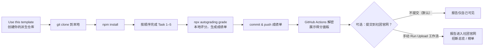

# Boyuan::Interview-Autograding-Template

欢迎来到该评测仓库！这个仓库是一套自动化的评测程序，用来检验你的开发环境与基础工具的使用能力。

> 使用该评测前必读!!! 请你严格按照如下规定进行评测, 否则可能会出现无法预料的问题.
>
> 欢迎朋友们观看[博远信息工作室](https://space.bilibili.com/695281681)的[《计算机教育中缺失的学期》](https://www.bilibili.com/video/BV1JkzGYuEGo)！

## 评测流程

评测的完整流程如下：



请你在本地完成五个 Task，运行 `npx autograding grade` 生成加密成绩单 `autograding_report.json`，提交并推送后由 GitHub Actions 解密展示得分。评分全程在本地进行。

报告单默认只展示给你自己看。**如想上传社团官网，可以手动提交（可选），见下方「5. 提交报告到社团官网」——push 不会自动上传。**

## 五个 Task

| 序号   | 主题            | 任务内容                                                | 分值 | 详情                         |
| ------ | --------------- | ------------------------------------------------------- | ---- | ---------------------------- |
| Task 1 | 配置运行环境    | 配置 Linux（WSL2）、Git、Python、Node.js，配置 SSH 密钥 | 100  | [task1.md](./tasks/task1.md) |
| Task 2 | 安装 Docker     | 安装并配置 Docker，使用 Compose 拉起 nginx 服务         | 100  | [task2.md](./tasks/task2.md) |
| Task 3 | 基础 Linux 操作 | 在 Docker 容器内进行文件操作与打包，并回答选择题        | 100  | [task3.md](./tasks/task3.md) |
| Task 4 | Makefile        | 为 AI 扣图工具编写构建、处理、打包、清理的 Makefile     | 100  | [task4.md](./tasks/task4.md) |
| Task 5 | Git 版本控制    | 通过分支、提交、合并的工作流修复一个脚本 bug            | 100  | [task5.md](./tasks/task5.md) |

五个 Task 各 100 分，满分 500 分。各 Task 按依赖顺序排列，前面 Task 是后面 Task 的基础，建议按顺序完成。

## 环境要求

评测需要在 Linux 环境下进行。Windows 用户可使用 WSL2（Windows Subsystem for Linux）搭建 Linux 环境，无需单独安装系统。Task 1 会说明具体的配置方式。

主要依赖如下：

| 依赖           | 版本要求                   | 用途                                                 | 备注                                           |
| -------------- | -------------------------- | ---------------------------------------------------- | ---------------------------------------------- |
| Node.js        | ≥ 20                       | 运行评测工具（`npx autograding grade`）；Task 1 检查 | 使用apt安装                                    |
| Git            | ≥ 2.30                     | Task 1 检查；Task 5 分支/提交/合并；成绩单归属       | 使用apt安装                                    |
| Python 3       | ≥ 3.10                     | Task 1 检查                                          | ubuntu自带                                     |
| Docker Engine  | 最新（需运行），含 Compose | Task 2 / Task 3 / Task 4；Task 2 检查 Compose        | https://docs.docker.com/engine/install/ubuntu/ |
| Docker Compose | 需单独安装                 | Task 2 检查 `docker compose` 编排能力                | —                                              |

> 使用 macOS 或原生 Linux 的用户可跳过 WSL2，具体见 [task1.md](./tasks/task1.md)。

## 操作步骤

### 1. 配置环境（Task 1）

先完成 [task1.md](./tasks/task1.md) 中的环境配置：WSL2 / Linux、Git、Python 3、Node.js，以及 Git SSH 密钥。Task 1 同时是首个计分任务，环境配置完成后即获得该部分分数。

### 2. 创建派生仓库

在本仓库页面点击右上角的 **"Use this template"**，在自己账号下创建派生仓库，建议命名为 `boyuan-interview-autograding`，然后克隆到本地：

```bash
git clone git@github.com:yourname/boyuan-interview-autograding.git
cd boyuan-interview-autograding
npm install
```

`npm install` 会安装评测工具，安装完成后即可使用 `npx autograding`。

### 3. 完成五个 Task

按顺序完成 [task1.md](./tasks/task1.md) 至 [task5.md](./tasks/task5.md)。每个 Task 文档包含详细步骤、操作示例与评分规则。

> Task 4 需在 `task4/` 目录下将 `starter_makefile` 复制为 `Makefile` 并补全 TODO，详见 [task4.md](./tasks/task4.md)。
>
> **请耐心等待 Task 2 和 Task 4 的下载与构建过程：** Task 2 首次运行时需要从 Docker Hub 拉取 `hello-world`、`nginx` 等镜像；Task 4 首次构建时需要拉取 Python 基础镜像并安装 AI 工具依赖。所需时间取决于网络状况，中途可能会较长时间没有新输出。只要终端没有明确报错，请不要按 `Ctrl+C` 或关闭终端，等待命令执行完成。

### 4. 评测并提交

在仓库根目录运行：

```bash
npx autograding grade
```

工具会依次检查五个 Task。其中 Task 3 会在终端逐题提问选择题，输入选项字母（A/B/C/D）并回车即可；若需非交互运行（如自动化脚本），可改用 `--answers` 一次性传入答案：

```bash
npx autograding grade --answers <15 道题答案，逗号分隔的 A-D>
```

（等价于设置环境变量 `AUTOGRADING_ANSWERS`，或在仓库根目录放一份 `quiz-answers.txt`，内容为逗号或空格分隔的 A-D。）评分结束后仓库根目录生成加密成绩单 `autograding_report.json`，终端显示总分与各项得分。

将成绩单提交并推送：

```bash
git add autograding_report.json
git commit -m "提交评测报告"
git push
```

push 后打开派生仓库的 **Actions** 标签页，在最新一次运行记录的 Job Summary 中查看总分、各 Task 得分与各项检查 pass/fail 明细。

> 可随时提交report。

### 5. 提交报告到社团官网（可选，默认不提交）

你的报告单默认只在你自己仓库的 Actions 记录里可见，**不会自动上传到官网**。如果你希望它可以上传到社团官网，请手动提交：

1. 在派生仓库打开 **Actions** 标签页；
2. 左侧选择 **Upload report to official site** 工作流；
3. 点右侧 **Run workflow**（分支保持默认即可）→ 运行一次。

运行结果为绿色，表示官网已收到报告；红色表示提交失败（网络或官网暂时不可用），**重新 Run workflow** 即可——官网按报告内容去重，重复提交安全。上传前会先校验报告单可正常解密（与 Actions 自反馈同一工具），损坏的报告不会被提交。

> 不运行此工作流 = 报告不会进入官网，你的得分记录完全由自己掌握。

## 常见问题

- **`npx autograding grade` 报错找不到命令**：确认已运行 `npm install`，且 Node.js 版本 ≥ 20。
- **GitHub Actions 提示"报告单解密失败"**：确认 `autograding_report.json` 是 `npx autograding grade` 生成的原始文件，未经手动编辑。
- **官网没收到我的报告？**：确认你手动运行过 `Upload report to official site` 工作流且结果为绿色。push 报告不会自动提交官网，需手动触发；若运行结果为红色，重新运行一次即可（官网按内容去重，重复提交安全）。
- **Task 4 得 0 分**：确认已在 `task4/` 目录复制 `Makefile` 并完成全部 TODO，且 Docker Desktop 正在运行。
- **Task 2 的 Compose 验证失败**：确认本地能拉取 `nginx` 镜像（可配置镜像加速或代理），`docker compose` 可用，且**已在运行 `grade` 前手动 `docker compose -f task2/compose.yml up -d` 拉起 nginx**（grader 不替你拉起，nginx 未 running 该项直接 0 分）。
- **Task 1 的 SSH 检查失败**：确认 `~/.ssh` 下有公钥、`ssh-add -l` 已加载密钥、指纹可解析（见 [task1.md](./tasks/task1.md)）。
- **Task 3 选择题卡住**：交互评测会逐题提问，输入选项字母（A/B/C/D）并回车；非交互环境（CI/脚本）需用 `--answers` 或 `AUTOGRADING_ANSWERS` / `quiz-answers.txt` 提供答案，否则 quiz 记 0 分（不会挂起）。
- **成绩单归属不对**：评测报告读取 `git config user.name`，可运行 `git config --global user.name "你的名字"` 设置。
- **Docker 命令需要 sudo**：Task 2 要求不使用 sudo。通常将当前用户加入 `docker` 组并重启终端即可。

## 技术分享练习仓库

以下仓库是2025技术分享配套的练习仓库，欢迎了解：

| 序号 | 主题                             | 仓库地址                                                                                                                                  |
| ---- | -------------------------------- | ----------------------------------------------------------------------------------------------------------------------------------------- |
| 1    | 理解与使用大模型 API（Lesson 1） | https://github.com/Boyuan-Autograder/technique-sharing-lesson-1-understanding-and-using-large-model-apis-Lesson-1-Understanding-and-Using |
| 2    | 构建面向对象对话程序（Lesson 2） | https://github.com/Boyuan-Autograder/technique-sharing-2025-2026-lesson2-build-an-object-oriented-dialogue-program-Lesson-2-Build-an-Obje |
| 3    | ASR 与 TTS（Lesson 4）           | https://github.com/Boyuan-Autograder/technique-sharing-2025-2026-lesson4-asr-and-tts-Lesson-4-ASR-and-TTS                                 |
| 4    | 多模态输入处理（Lesson 5）       | https://github.com/Boyuan-Autograder/technique-sharing-2025-2026-lesson-5-multimodal-input-processing-beyond-ocr-and-text-technique-shari |
| 5    | RAG 作业（Lesson 6）             | https://github.com/Boyuan-Autograder/technique-sharing-2025-2026-lesson6-rag-rag-assignment                                               |

## 给维护者：端到端烟测

> 本节面向评测维护者，非仓库维护者可忽略。

修改模板仓后，可通过引导脚本重跑完整评测流程，验证从 "Use this template" 到在 Actions 查看得分面板的全链路：

```bash
./scripts/smoke-test.sh
```

脚本按 8 个步骤引导：创建派生仓库 → clone → npm install → 完成 Task 4 的 Makefile → 完成 Task 5 的 Git 工作流 → 运行 grade → 提交并推送成绩单 → 在 Actions 查看 Job Summary。
